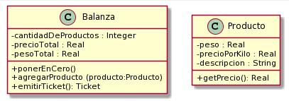
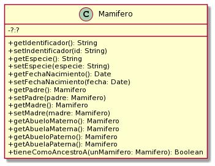

# Ejercicios prácticos

## Ejercicio 2: Balanza Electrónica  
**Descripción:** En términos generales, la Balanza electrónica recibe productos (uno a uno), y calcula dos totales: peso total y precio total. Además la balanza puede poner en cero todos sus valores. La balanza no guarda los productos. Luego emite un ticket que indica número de productos considerados, peso total, precio total.  
**Implemente:** Cree un nuevo proyecto Maven llamado balanzaElectronica, siguiendo los pasos del documento “Trabajando con proyectos Maven, crear un proyecto Maven nuevo”. En el paquete correspondiente, programe las clases que se muestran a continuación.
 

 
Observe que no se documentan en el diagrama los mensajes que nos permiten obtener y establecer los atributos de los objetos (accessors). Aunque no los incluimos, verá que los tests fallan si no los implementa. Consulte con el ayudante para identificar, a partir de los tests que fallan, cuales son los accessors necesarios (pista: todos menos los setters de balanza). Todas las clases son subclases de Object.  
**Nota:** Para las fechas, utilizaremos la clase java.time.LocalDate. Para crear la fecha actual, puede utilizar LocalDate.now().  
Enlaces a la solución:
- [Clases main](oo1-2022-main/practica/ejercicio02_BalanzaElectronica/src/main/java/ar/edu/unlp/info/oo1)
- [Clases test](oo1-2022-main/practica/ejercicio02_BalanzaElectronica/src/test/java/ar/edu/unlp/info/oo1)

## Ejercicio 3: Presupuestos  
Defina el proyecto Ejercicio 3 - Presupuesto y dentro de él Implemente las clases que se observan en el siguiente diagrama. Ambas son subclases de Object. Preste atención a los siguientes aspectos
 

**Probando su código:** Utilice los tests provistos para confirmar que su implementación ofrece la funcionalidad esperada. En este caso, se trata de dos clases, ItemTest y PresupuestoTest, que debe agregar dentro del paquete tests. Haga las modificaciones necesarias para que el proyecto no tenga errores. Siéntase libre de explorar las clases de test para intentar entender qué es lo que hacen.  
Enlaces a la solución:
- [Clases main](oo1-2022-main/practica/ejercicio03_Presupuestos/src/main/java/ar/edu/info/oo1/ej3_presupuestos)
- [Clases test](oo1-2022-main/practica/ejercicio03_Presupuestos/src/test/java/ar/edu/info/oo1/ej3_presupuestos)

## Ejercicio 3 - Bis: Balanza mejorada  
**Tarea 1:** Mejorar la balanza para que recuerde los productos ingresados (los mantenga en una colección). Analice de qué forma puede realizarse este nuevo requerimiento e implemente el mensaje `getProductos() : List<Producto>` que retorna todos los productos ingresados a la balanza (en la compra actual, es decir, desde la última vez que se la puso a cero).  
**Tarea 2:** Con esta nueva funcionalidad, podemos enriquecer al Ticket, haciendo que él también conozca a los productos (a futuro podríamos imprimir el detalle). Ticket también debería entender el mensaje `getProductos():List<Producto>`.  
Enlaces a la solución:
- [Clases main](oo1-2022-main/practica/ejercicio03_BalanzaElectronicaMejorada/src/main/java/ar/edu/unlp/info/oo1)
- [Clases test](oo1-2022-main/practica/ejercicio03_BalanzaElectronicaMejorada/src/test/java/ar/edu/unlp/info/oo1)

## Ejercicio 4: Figuras y cuerpos  
**Figuras en 2D**  
Defina un nuevo proyecto figurasYCuerpos. En Taller de Programación definió clases para representar figuras geométricas. Retomaremos ese ejercicio para trabajar con Cuadrados y Círculos.  
El siguiente diagrama de clases documenta los mensajes que estos objetos deben entender.  
Decida usted qué variables de instancia son necesarias. Ambas clases son subclases de Object.  
Puede agregar mensajes adicionales si lo cree necesario.
 

Fórmulas y mensajes útiles:
- Diámetro del círculo: radio * 2
- Perímetro del círculo: π * diámetro
- Área del círculo: π * radio 2
- π se obtiene enviando el mensaje #pi a la clase Float (Float pi) (ahora Math.PI)

**Cuerpos en 3D**  
Ahora que tenemos Círculos y Cuadrados, podemos usarlos para construir cuerpos (en 3D) y calcular su volumen y superficie o área exterior. Vamos a pensar a un cilindro como "un cuerpo que tiene una figura 2D como cara basal y que tiene una altura (vea la siguiente imagen)". Si en el lugar de la figura2D tuviera un círculo, se formaría el siguiente cuerpo 3D.  
Si reemplazamos la cara basal por un rectángulo, tendremos un prisma (una caja de zapatos). 
El siguiente diagrama de clases documenta los mensajes que entiende un cuerpo3D. Decida usted qué variables de instancia son necesarias. Cuerpo3D es subclase de Object. 
Decida usted si es necesario hacer cambios en las figuras 2D.  
 
 
Fórmulas útiles:
- El área o superficie exterior de un cuerpo es: 2* área-cara-basal + perímetro-cara-basal * altura-del-cuerpo.
- El volumen de un cuerpo es: área-cara-basal * altura.
**Pruebas automatizadas**  
Siguiendo los ejemplos de ejercicios anteriores, ejecute las pruebas automatizadas provistas. En este caso, se trata de tres clases que debe agregar dentro del paquete tests.  
Haga las modificaciones necesarias para que el proyecto no tenga errores. Si algún test no
pasa, consulte al ayudante.  
Enlaces a la solución:
- [Clases main](oo1-2022-main/practica/ejercicio04_ FigurasYCuerpos/src/main/java/ar/edu/info/oo1/ej4_figuras)
- [Clases test](oo1-2022-main/practica/ejercicio04_ FigurasYCuerpos/src/test/java/ar/edu/info/oo1/ej4_figuras)

## Ejercicio 5: Genealogía salvaje  
En una reserva de vida salvaje (como la estación de cría ECAS, en el camino Centenario),
los cuidadores quieren llevar registro detallado de los animales que cuidan y sus familias.
Para ello nos han pedido ayuda. Debemos:  
a) Modelar en objetos y programar la clase Mamífero (como subclase de Object). El
siguiente diagrama de clases (incompleto) nos da una idea de los mensajes que un
mamífero entiende. 
 
 
 
b) Complete el diagrama de clases para reflejar los atributos y relaciones requeridos.  
Observe que no se documentan en el diagrama los mensajes que nos permiten obtener y
establecer los atributos de los objetos (accessors). Aunque no los incluimos, verá que los tests
fallan si no los implementa. Consulte con el ayudante para identificar, a partir de los tests que
fallan, cuales son los accessors necesarios (pista: todos menos los setters de balanza).
Todas las clases son subclases de Object.  
Nota: Para las fechas, utilizaremos la clase java.time.LocalDate. Para crear la fecha actual,
puede utilizar LocalDate.now().  
c) Siguiendo los ejemplos de ejercicios anteriores, ejecute las pruebas automatizadas
provistas. En este caso, se trata de una clase, MamiferoTest, que debe agregar dentro del
paquete tests. 
 
 
 
Enlaces a la solución:
- [Clases main](oo1-2022-main/practica/ejercicio05_GenealogiaSalvaje/src/main/java/ar/edu/unlp/info/oo1/ejercicio5)
- [Clases test](oo1-2022-main/practica/ejercicio05_GenealogiaSalvaje/src/test/java/ar/edu/unlp/info/oo1/ejercicio5)

## Ejercicio 6: Red de Alumbrado
Imagine una red de alumbrado donde cada farola está conectada a una o varias vecinas formando un grafo conexo2. Cada una de las farolas tiene un interruptor. Es suficiente con encender o apagar una farola cualquiera para que se enciendan o apaguen todas las demás.  
Sin embargo, si se intenta apagar una farola apagada (o si se intenta encender una farola encendida) no habrá ningún efecto, ya que no se propagará esta acción hacia las vecinas.  
La funcionalidad a proveer permite:
1. crear farolas (inicialmente están apagadas).
2. conectar farolas a tantas vecinas como uno quiera (las conexiones son bi-direccionales).
3. encender una farola (y obtener el efecto antes descrito).
4. apagar una farola (y obtener el efecto antes descrito).  
**Tareas:** Realice el diagrama UML de clases de la solución al problema.  
Enlaces a la solución:
- [Clases main](oo1-2022-main/practica/ejercicio06_RedDeAlumbrado/src/main/java/ar/edu/unlp/info/oo1/ej06_redDeAlumbrado)
- [Clases test](oo1-2022-main/practica/ejercicio06_RedDeAlumbrado/src/test/java/ar/edu/unlp/info/oo1/ej06_redDeAlumbrado)

## Ejercicio 8: Distribuidora Electrica

Una distribuidora eléctrica desea un sistema para el registro de los consumos de sus usuarios y para la emisión de facturas de cobro.  
El sistema permite registrar usuarios, para los cuales se indica nombre y dirección. Por simplificación, un usuario puede estar relacionado con un solo domicilio (para el que se registran los consumos).  
El sistema permite registrar los consumos para los usuarios. Los consumos que se registran para los usuarios tienen dos componentes, el consumo de energía activa y el consumo de energía reactiva.  
Una vez al mes, la empresa distribuidora realiza el proceso de facturación. Por cada usuario se emite una factura (el proceso completo retorna una colección).  
Para emitir la factura de un cliente se tiene en cuenta su último consumo y se calcula su factor de potencia para determinar si hay alguna bonificación para aplicar. El costo del consumo se calcula multiplicando el consumo de energía activa por el precio del kwh (Kilowatt/hora) de la empresa. La energía reactiva no tiene costo para el usuario. Si el factor de potencia estimado (pfe) del último consumo del usuario es mayor a 0.8, el usuario es
bonificado con el 10%.  
Además, la empresa está interesada en poder saber cuál fue el total de energía activa consumida por toda la red en el último periodo medido (es decir, teniendo en cuenta sólo la última medición de cada usuario).  
El siguiente diagrama de clases muestra el diseño para este problema. Agregue los métodos que considere necesarios.  

 
**Tareas**  
Siguiendo el diseño que se muestra en el diagrama de clases, implemente la funcionalidad que se describe en el enunciado, en particular en lo referente a: 
1. Establecer (setear) el precio del KWh de la empresa.
2. Agregar usuarios.
3. Agregar mediciones.
4. Emitir facturas.
5. Obtener el consumo total en KWh de la red para el último período.

En una clase de test, cree los test de unidad necesarios para poder evaluar:  
1. Iniciar el sistema
2. Agregar un usuario
3. Agregar un consumo para ese usuario
4. Emitir las facturas
5. Calcular el consumo total de la red para el último período  

Enlaces a la solución:
- [Clases main](oo1-2022-main/practica/ejercicio08_DistribuidoraElectrica/src/main/java/ar/edu/unlp/info/oo1/ej08_distribuidoraElectrica)

## Ejercicio 9: Cuenta con Ganchos

Enlaces a la solución:
- [Clases main](oo1-2022-main/practica/ejercicio09_CuentaConGanchos/src/main/java/ar/edu/unlp/info/oo1/ej09_CuentaConGanchos)
- [Clases test](oo1-2022-main/practica/ejercicio09_CuentaConGanchos/src/test/java/ar/edu/unlp/info/oo1/ej09_CuentaConGanchos)

## Ejercicio 11: El inversor

Enlaces a la solución:
- [Clases main](oo1-2022-main/practica/ejercicio11_ElInversor/src/main/java/ar/edu/unlp/info/oo1/ej11_ElInversor)
- [Clases test](oo1-2022-main/practica/ejercicio11_ElInversor/src/test/java/ar/edu/unlp/info/oo1/ej11_ElInversor)

## Ejercicio 12: Volumen y Superficie de Sólidos

Enlaces a la solución:
- [Clases main](oo1-2022-main/practica/ejercicio12_VolumenYSuperficieDeSolidos/src/main/java/ar/edu/unlp/info/oo1/ej12_VolYSupeDeSolidos)
- [Clases test](oo1-2022-main/practica/ejercicio12_VolumenYSuperficieDeSolidos/src/test/java/ar/edu/unlp/info/oo1/ej12_VolYSupeDeSolidos)

## Ejercicio 13: Cliente de Correo con Adjuntos

Enlaces a la solución:
- [Clases main](oo1-2022-main/practica/ejercicio13_ClienteDeCorreo/src/main/java/ar/edu/unlp/info/oo1/ej13_ClienteDeCorreo)
- [Clases test](oo1-2022-main/practica/ejercicio13_ClienteDeCorreo/src/test/java/ar/edu/unlp/info/oo1/ej13_ClienteDeCorreo)

## Ejercicio 15: Alquiler de propiedades
**Nota: este ejercicio es del estilo de los que encontrarán en la evaluación parcial**

Enlaces a la solución:
- [Clases main](oo1-2022-main/practica/ejercicio15_AlquilerDePropiedades/src/main/java/ar/edu/unlp/info/oo1)

## Ejercicio 16: Políticas de cancelación
**Nota: este ejercicio es del estilo de los que encontrarán en la evaluación parcial**

Enlaces a la solución:
- [Clases main](oo1-2022-main/practica/ejercicio16_PoliticasDeCancelacion/src/main/java/ar/edu/unlp/info/oo1)

## Ejercicio 17: Facturación de llamadas
**Nota: este ejercicio es del estilo de los que encontrarán en la evaluación parcial**

Enlaces a la solución:
- [Clases main](oo1-2022-main/practica/ejercicio17_FacturacionDeLlamadas/src/main/java/ar/edu/unlp/info/oo1)

## Ejercicio 18: Liquedación de haberes
**Nota: este ejercicio es del estilo de los que encontrarán en la evaluación parcial**

Enlaces a la solución:
- [Clases main](oo1-2022-main/practica/ejercicio18_LiquidacionDeHaberes/src/main/java/ar/edu/unlp/info/oo1)

## Ejercicio 19: Mercado de objetos
**Nota: este ejercicio es del estilo de los que encontrarán en la evaluación parcial**

Enlaces a la solución:
- [Clases main](oo1-2022-main/practica/ejercicio19_MercadoDeObjetos/src/main/java/ar/edu/unlp/info/oo1)

